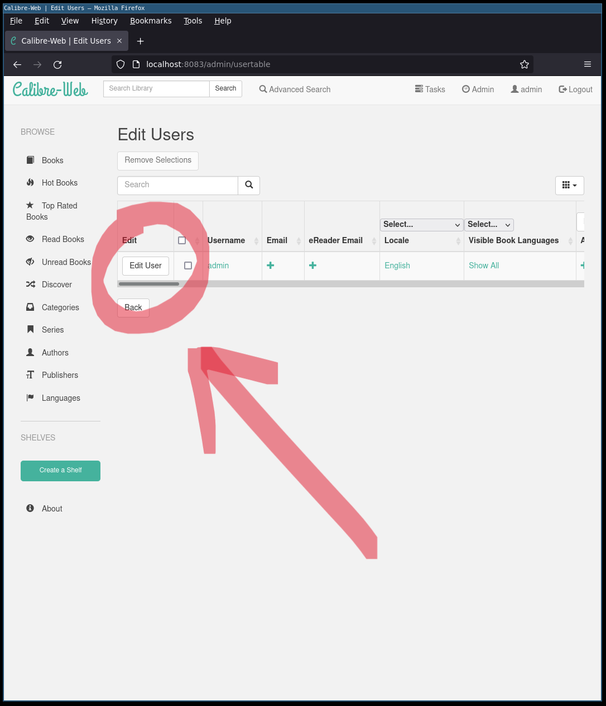

# PURPOSE
The purpose of this Docker builder is to build a self-contained docker container that contains your personal e-book library (Calibre) in such a way that you can read the PDFs and e-books in it without any additional software on your host (only using a web-browser).

Additionally, this repository contains additional scripts that encrypt your e-book library with a password of your choosing, so you can share your container publicly.

The ultimate goal is this getting this: a fully self-contained PDF and e-books library and reader, requiring no additional software, that supports encryption of the library for portability and fetchability from the internet. 

Full Library


Metadata (including notes, tags, and highlights) preserved


Browser-based reading (again requiring now client-side software)


Note: 
This is a clone of the "calibre-web" linuxserver.io Docker builder at a [*SPECIFIC* revision](https://github.com/linuxserver/docker-calibre-web/releases/tag/nightly-d32b2ca5-ls39) that I had (thru much trial-and-error rewind to find) for this purpose. Building a *new* docker "FROM" the public pre-build dockers at ":latest" and simply copying your e-book library into it did not work. Doing this resulted in a flurry of filesystem layer errors when "commit"ing the  layer changes or running on a new system.

I published this publicly to capture all the trial/error work and document it here in detail, so i never have to think about it again.

# How to Use
You can use this Docker image in several different ways:

1. You can simply checkout the existing pre-built container and use it to view a Calibre library directory shared into it (from the Host). (This was the initial intent of the calibre-web docker container from linuxserver.io)
2. Using my modifications to the Docker build process and my added scripts, you can produce your own self-contained docker container that contains YOUR Calibre Library. This makes your entire Library (and the reader/viewer for it) self-contained and portable.

# Building your own portable Calibre Library :
To build your own portable Calibre library using this repository:

1. Clone this repository onto a linux system (my custom scripts assume a standard linux system with bash) which also contains your Calibre library accessible on the same filesytem

2. In the repository read and run `cd calibrelibrary;./prepare.sh`. It is user-friendly.


3. With your Calibre Library now prepared for transport *INSIDE* the container you can now build the container

4. Build the container by: `docker build -t <whatever_you_want_yours_named> .` EXAMPLE: `docker build -t sa7ori/researchers_library .`


5. DO NOT START THE CONTAINER YET!

6. First `docker push` (to wherever you want it hosted) or (if working offline) locally save your successfully newly built image example: with `docker save -o <whatever_yours_is_named>.tar <whatever_yours_is_named>:latest` EXAMPLE: `docker save -o researchers_library.tar researchers_library:latest`

7. It is now sharable via the repository you pushed to, or locally by sharing the .tar of the image/VM. (Importable with: `docker load --input researchers_library.tar` or whatever your tar is named)

## Running your newly built container:
Remember, this is a modified version of a original builder at a specific revision. I'll spare you the details, but it took a long while to find a working one.

FYI: The original version of the dockerfile is this: version: `https://hub.docker.com/r/linuxserver/calibre-web/tags?page=154` aka `amd64-nightly-d32b2ca5-ls39` and the original Dockerfile repo:
https://github.com/linuxserver/docker-calibre-web/releases/tag/nightly-d32b2ca5-ls39

Anyway, upon first run the ORIGINAL container would normally download package updates from linuxserver.io and apply some new file-system layers, and then execute the web-app using a mounted shared-volume (from the host) to serve the ebooks from.

We will be doing the same thing, but instead our modifications mean there will be no mounted volume since our Library was copied into the Image at build-time. We have to prepare that directory manually since it requires password input (for decrpytion).

1. To do this, we will execute `use.sh` inside the Container. You can read thru `calibrelibrary/README.TXT` to understand what happens next in more detail.
2. Run the container in "interactive drop-to-shell" mode with :
```
sudo docker run -it \
  -e PUID=1000 \
  -e PGID=1000 \
  -e TZ=Etc/UTC \
  -e DOCKER_MODS=linuxserver/mods:universal-calibre `#optional` \
  -e OAUTHLIB_RELAX_TOKEN_SCOPE=1 `#optional` \
  -p 8083:8083 \
  --restart unless-stopped \
  researchers_library:latest bash
```


3. Once in the container, cd `/books/` and run `./use.sh` this will extract and decrypt your library prompting you for password.

(ignore the errors, they are only for "desktop integration" which we dont care about anyway)


4. Now, your library should be ready to use by browsing to http://localhost:8083 from the Host OS the Container is running on. (You can exit the previous terminal, the container and webapp will remain running) . You should be greeted with a login screen the default is `admin/admin123`


5. After login the webapp will ask you the location of the Library and the database. Now enter the path to our library database `/books/CalibreLibrary/metadata.db`. When you click save it will not appear that the changes took, Click "Books"


6. You should see your entire library. 


Scroll to make sure everything is there.


## Important final step
(I forgot this in original version of this doc)
At each boot of this container, you will have to repeat all these steps unless you "commit" the changes that occurred after boot BACK to the original image so they persist in the "image".

Since Docker works like "snapshot"ed Virtual Machines, all the filesystem modifications that happened since boot will disappear once it is stopped or "powered off". 
The Docker "image" remains pristine and "read-only", but while the "image" runs as a "container" instance, the filesystem changes are virtualized (copy-on-write or something, I dunno) and are discarded unless they are applied to the "image". 

Anyway to capture any changes in the filesystem that happened while the "image" was running as a "container" instance. we have to commit. 
To do that, while the instance is running get its instance id aka "container id"
`sudo docker ps`
then commit that instance to a new image:
`sudo docker commit 6239ad16278e researchers_library_installed`


This effectively snapshots the "container" and saves it as a new "image" called `researchers_library_installed`

Alternatively you could save the snapshot using a branchtag of the original image (Docker "best practices" seem to do this but I never do)
`sudo docker commit 6239ad16278e researchers_library:installed_decrypted`

Ok. that's it.

## Minor UI Fixes

By default, the webapp UI is not configured to not allow in-browser reading. By default when you view a book you will only prompted for download., (Note the lack of "read in browser" option). 


To fix this, it must be enabled via the Admin screen. Open the Admin "User Editor" to edit your user settings:


Edit your user:



Check this "Allow ebook viewer" (remember to apply changes)


Now when you view a book it should have the option to "View In Browser"


Now you should be able to select any book and read it in-browser, PDFs alike.


# Using this Docker Image as-is:
To use the docker container as-is:

1. Clone the pre-built container with: `docker clone sa7ori/researchers_library`
2. To run it execute: 
```
sudo docker run \
  -e PUID=1000 \
  -e PGID=1000 \
  -e TZ=Etc/UTC \
  -e DOCKER_MODS=linuxserver/mods:universal-calibre `#optional` \
  -e OAUTHLIB_RELAX_TOKEN_SCOPE=1 `#optional` \
  -p 8083:8083 \
  --restart unless-stopped \
  researchers_library:latest
```

